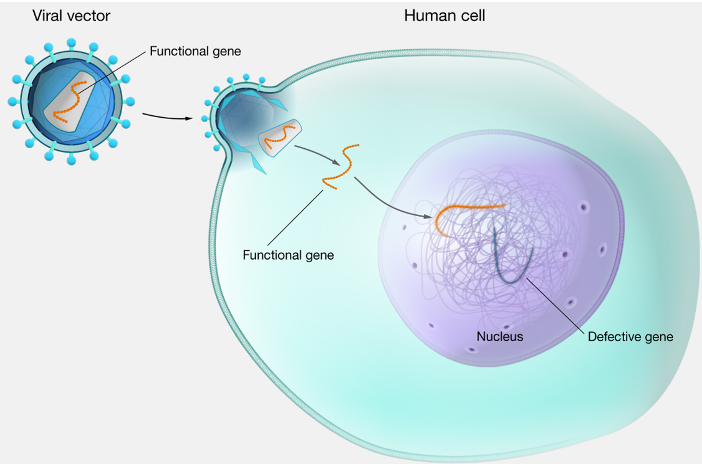
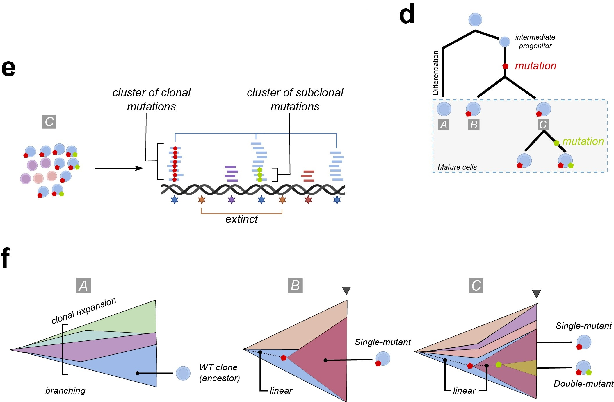
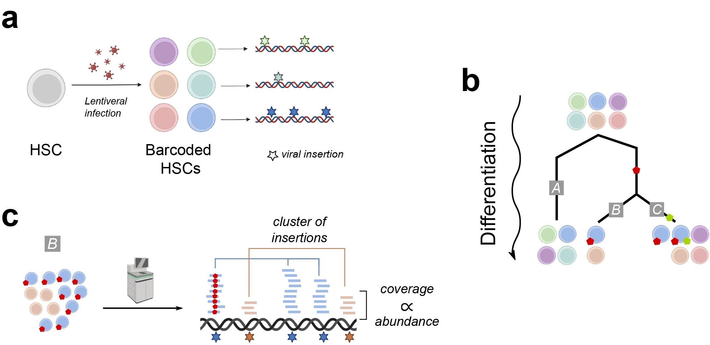
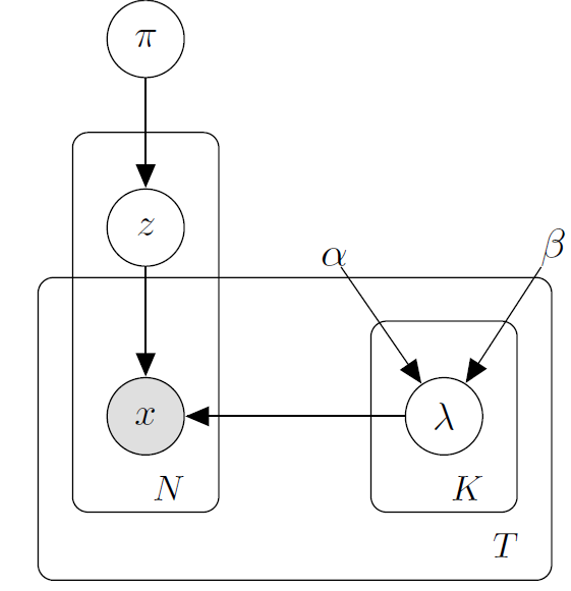
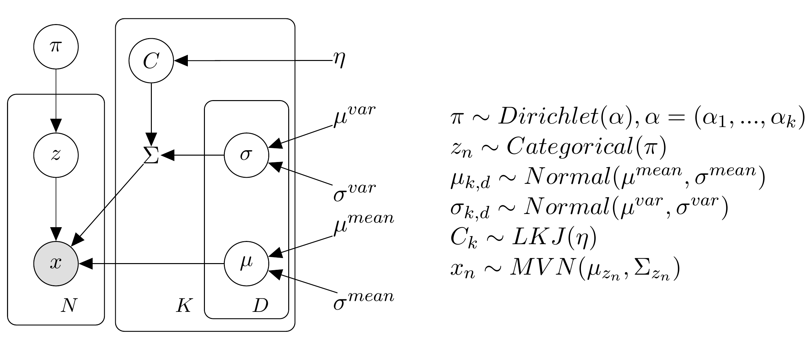

```{r include=FALSE}
library(lineaGT)
library(tidyverse) 
```

# Contents

-   [Problem description]
    -   [Gene therapy (GT)](#gene-therapy-gt)
    -   [Possible problems in GT applications]
-   [Data](#data-1)
    -   [Experimental design]
    -   [Dataset]
-   [Model description] <!-- -   [Poisson Mixture Model] -->
    -   [Multivariate Normal Mixture Model]
        -   [Latent parameters]
        -   [Experimental validation dataset to model variances]
-   [Stochastic Variational Inference (SVI)](#stochastic-variational-inference-svi)
    -   [Pyro implementation]
-   [Results]
    -   [Murine data](#data-1)
        -   [Model selection and convergence]
        -   [Evaluating clustering]

# Problem description

<!-- -   What's gene therapy and why it's used -->

<!-- -   problem of mutagenesis ... -->

## Gene therapy (GT) {#gene-therapy-gt}

Gene therapy applications are used to **recover the functionality of a defective gene**, causing a disease in the patient.

-   A viral vector is used to insert the correct gene sequence in the patient cells genome to restore its functionality.

-   During cell replication, the cells with the *missing* gene will be replaced by the cells carrying the correct sequence.

-   This is usually performed on **Hematopoietic Stem Cells** (HSCs), from which the different blood cell types originate.

<center>{width="579"}</center>

## Possible problems in GT applications

The lentiviral insertion occurs at semi-random in the genome and this might:

-   cause **gene deregulation**,
-   give rise to **mutations** leading to cancerous cell populations.

Monitoring and studying such abnormalities over time in multiple lineages might help to improve the safety of GT applications.

**Aim of the project:** reconstruct clones (cell populations) originated from the same HSC to monitor their evolution over time and across lineages.

# Data

## Experimental design

-   **Insertion Site (IS)**: genomic sequence inserted in a specific genomic position. Since insertion is *random*, each IS is **unique** and acts as a *barcode*.

-   **Next Generation Sequencing (NGS)**: DNA is fragmented and each fragment is sequenced and then mapped to the reference genome.

-   **Locus coverage** (or *locus depth*): number of fragments mapping to the locus (i.e. genomic position).

<!-- {width="422"} -->

<center>{width="592"}</center>

a.  HSCs are infected with lentiviral vectors carrying the same gene and thus ***barcoded*** **with a set of ISs**.

b.  The barcoded HSCs replicates and **each descendant will carry the parent's ISs**.

    The HSCs will differentiate into three cell lineages.

c.  The regions with ISs are sequenced and the **coverage of an IS is proportional to its abundance in the sample**.

To sum up:

1.  *clone:* set of cells originated from the same HSC and sharing the parent HSC's ISs;
2.  *coverage* of an IS $\propto$ *abundance* of the clone carrying it in the sample;
3.  ISs with similar coverage will likely belongs to the same clone;
4.  multiple cell populations are present in heterogeneus proportions in the samples.

**Therefore, to identify clones, we can cluster co-occurring ISs using their coverage over time and across lineages.**

## Dataset

The dataset is a $N ✕ D$ matrix

-   $N$ rows $\rightarrow$ number of ISs,

-   $D$ columns $\rightarrow$ number of multi-lineages longitudinal observations.

Each entry $x_{n,d}$ of the matrix is the coverage of $n-$th IS in the $d-$th longitudinal sample.

```{r include=FALSE}
data = readRDS("data.Rds")
```

This dataset contains `570` ISs.

```{r echo=FALSE}
data %>% lineaGT:::long_to_wide_cov() %>% nrow()
```

It contains samples from three lineages.

```{r echo=FALSE}
data %>% dplyr::pull(lineage) %>% unique()
```

It contains observations over three timepoints.

```{r echo=FALSE}
data %>% dplyr::pull(timepoints) %>% unique()
```

```{r echo=FALSE}
data %>% 
  lineaGT:::long_to_wide_cov() %>% 
  head() %>% 
  knitr::kable()
```

# Model description

This phenomenon can be modeled as a *mixture model*, where each mixture component corresponds to the multivariate distribution of coverage for a single clone.

A mixture model with $K$ components is defined as a superposition of $K$ densities:

$$
p(X) = \sum^K_{k=1} \pi_k p(X|\theta_k).
$$

~[Bishop, C.M. (2006) 'Pattern recognition', Machine learning, 128(9). Available at: <https://www.academia.edu/download/30428242/bg0137.pdf>.]~

<!-- ## Poisson mixture model -->

<!-- Since we are dealing with count-based data, the first developed model was a Poisson mixture model. However, since the Poisson rate corresponds also to distribution variance, it was not possible to identify clones with high mean (i.e., high coverage) and low variance. -->

<!-- <center>{width="242"}</center> -->

## Multivariate Normal mixture model

We eventually developed and implemented a Multivariate Normal mixture model, in order to model the components variances and add model the correlation among dimensions.

The model likelihood is

$$
p(X|Z,\pi,\mu,\Sigma) = \prod_{n=1}^N\sum_{k=1}^K\pi_k \mathcal{N}(x_n|\mu_k,\Sigma_k).
$$

-   $\mathcal{N}(X|\mu_k, \Sigma_k)$ is the density of component $k$, charachterized by parameters $\mu_k, \Sigma_k$.

-   $Z$ is a $N-$dimensional vector of latent clustering assignments such that $z_n \in {1,…,K}$.

<center>{width="588"}</center>

### Latent parameters

-   $\pi_k$ are called *mixing coefficients* and are positive values such that $\sum_{k=1}^K \pi_k = 1$.

    They corresponds to the pior probability for $Z$, such that $p(z_n=k)=\pi_k$.

-   The model estimates the full covariance matrix, to infer also the correlation among dimensions, and it is decomposed as $\Sigma = SCS$:

    -   $C$ is the correlation matrix, with unitary diagonal elements and off-diagonal correlation entries defined as $C_{d,l} = \frac{\sigma_{d,l}}{\sigma_d \sigma_l}$,

    -   $S$ is a diagonal matrix $\sqrt{diag(\Sigma)}$, with dimensions' standard deviations $\sigma_d$ on the diagonal.

Therefore, the **learned parameters** are:

-   $K ✕ D$ matrix of means $\mu$,

-   $K ✕ D$ matrix or variances $\sigma$,

    $K$ $D ✕ D$ correlation matrices $C$,

-   $K-$dimensional vector of mixing proportions $\pi$,

and each observation is assigned to the cluster maximising the probability$$
p(z_i=k|x_i) = \frac{\pi_k\mathcal{N}(x_i|k)}{\sum_{l=1}^K \pi_l \mathcal{N}(x_i|l)}.
$$

### Experimental validation dataset to model variances

Eventually, to avoid an overestimation of the variances, we used the experimental validation dataset to fit a linear model of the variance as a function of the mean coverage. Then, the variances for each component, timepoint and lineage will be constrained to be smaller than the linear model in the estimated mean coverage.

```{r warning=FALSE, include=FALSE}
cloneA = c("UTP15(+)_chr5:72866480(-)")

cloneB = c("FARSB(-)_chr2:223461674(+)",
           "VRK1(+)_chr14:97342533(+)",
           "CREB1(+)_chr2:208325826(+)",
           "LOC100507487(+)_chr4:129335149(+)")

cloneC = c("TMEM64(-)_chr8:91674211(-)",
           "LINC01477(+)_chr18:38162304(-)",
           "GTF2A1(-)_chr14:81652945(-)",
           "LTA4H(-)_chr12:96398298(-)",
           "MIR3672(+)_chrX:120619080(-)",
           "IMMP2L(-)_chr7:110789918(-)")

cloneD = c("SUPT3H(-)_chr6:45172433(+)",
           "TIMM44(-)_chr19:8002970(-)",
           "GAK(-)_chr4:909971(-)",
           "RPL27A(+)_chr11:8711542(-)",
           "VANGL2(+)_chr1:160414727(-)",
           "PDE5A(-)_chr4:120428505(-)",
           "ADGRL3-AS1(-)_chr4:63782063(-)",
           "IREB2(+)_chr15:78770928(-)",
           "NCOA6(-)_chr20:33384442(+)",
           "TNFRSF21(-)_chr6:47118860(-)",
           "NUP210L(-)_chr1:154007969(-)"
           )

mixIS = list(A=cloneA,B=cloneB,C=cloneC,D=cloneD) %>%
  reshape2::melt(value.name="IS") %>% dplyr::rename(cloneID=L1)

data.val = readRDS("./data.val.Rds")
```

```{r echo=FALSE}
# data.val %>% head() %>% knitr::kable()
# mixIS %>% head() %>% knitr::kable()  # true clones
```

```{r eval=FALSE, include=FALSE}
# x.val = fit(cov.df=data.val %>% 
#                  filter_dataset(min_cov=5, min_frac=0),
#                steps=500,
#                k_interval=c(2,10),
#                infer_growth=F,
#                default_lm=T
#                )
# saveRDS(x.val, "./x.val.Rds")
```

```{r echo=FALSE}
x.val = readRDS("./x.val.Rds")
```

```{r echo=FALSE, fig.height=5, fig.width=6, message=FALSE, warning=FALSE}
var_df = data.val %>% dplyr::group_by(timepoints, cloneID) %>%
  filter(!IS %in% c("TNFRSF21(-)_chr6:47118860(-)","NUP210L(-)_chr1:154007969(-)")) %>% 
  dplyr::summarise(mean = 1/dplyr::n() * sum(coverage),
                   variance = sqrt( 1/dplyr::n() * sum( (coverage - mean)^2 ) ),
                   ) %>%
  tidyr::drop_na() %>%
  filter(cloneID!="A")

# var_df %>%
#   ggplot() +
#   geom_point(aes(x=mean, y=variance, color=cloneID)) +
#   lineaGT:::my_ggplot_theme() +
#   ylab("Variance") + xlab("Mean coverage") +
#   labs(title="Variance vs Mean coverage computed for each clone in each mix")


regr_df = data.frame("x"=1:3000)
l_model_B = lm(variance~mean, data=filter(var_df, cloneID=="B"))
coef = coefficients(l_model_B)
regr_df = regr_df %>%
  dplyr::mutate(y_B=coef[2]*x + coef[1],
                coef_B=list(coef))

l_model_C = lm(variance~mean, data=filter(var_df, cloneID=="C"))
coef = coefficients(l_model_C)
regr_df = regr_df %>%
  dplyr::mutate(y_C=coef[2]*x + coef[1],
                coef_C=list(coef))

l_model_D = lm(variance~mean, data=filter(var_df, cloneID=="D"))
coef = coefficients(l_model_D)
regr_df = regr_df %>%
  dplyr::mutate(y_D=coef[2]*x + coef[1],
                coef_D=list(coef))


regr_df %>%
  ggplot() +
  geom_line(aes(x=x, y=y_B)) +
  geom_line(aes(x=x, y=y_C)) +
  geom_line(aes(x=x, y=y_D)) +
  geom_point(data=var_df, aes(x=mean, y=variance, color=cloneID)) +
  lineaGT:::my_ggplot_theme() +
  ylab("Estimated variance") + xlab("Mean coverage") +
  labs(title="Linear regression of variances varying the mean coverage")

```

## Prior distributions

The latent variables and parameters of the model are $Z, \pi, \mu, \sigma$ and $C$:

-   $\pi \sim Dirichlet(\alpha) \rightarrow$ all clusters are a priori assumed to have equal probability, hence $\alpha_k=1/K$.

-   $Z \sim Categorical(\pi) \rightarrow$ Categorical with concentration parameter $\pi$.

-   $p(\mu_{k,d}) \sim Normal(\mu^{mean}, \sigma^{mean}) \rightarrow$ Normal constrained to assume positive values with hyperparameters $\mu^{mean}, \sigma^{mean}$.

    By default, since we do no know a priori the range of coverage values, the hyperparameters values are set to the coverage mid-point and standard deviations.

-   $p(\sigma_{k,d}) \sim Normal(\mu^{var}, \sigma^{var}) \rightarrow$ Normal constrained to assume positive values with hyperparameters $\mu^{var}, \sigma^{var}$.

    The values of the hyperparameters have been tuned using an experimental validation dataset to explore the true variability we are likely to observe in these experiments and are set to 120 and 130, respectively.

-   $p(C_{k}) \sim LKJ(\eta) \rightarrow$ Lewandowski-Kurowicka-Joe (LKJ) distribution, set with default hyperparameter $\eta=1$, assuming a uniform density over all correlation matrix, since we are not aware a priori of strong or weak correlations among dimensions.

# Stochastic Variational Inference (SVI) {#stochastic-variational-inference-svi}

Given our models we want to learn values for the parameters $W = (Z,\mu,\sigma,C)$. The aim is to learn the posterior distribution of the latent parameters $$
p(W|X) = \frac{p(X|W)p(W)}{p(X)}.
$$ Ideally, we would like to find the set of parameters such as to maximise the log evidence, usually unfeasible to compute: $$
W^* = \text{argmax}_W \text{log}(p(X))
$$

The idea behind VI is to find a *variational distribution* $q(W)$ to approximate the true posterior $p(W|X)$. The task is an optimization problem, aiming at finding the distribution as to minimize the KL divergence between the variational and true posteriors: $$
q^*(W) = \text{argmin}_{q(W)\in\mathcal{Q}} KL[q(W)||p(W|X)].
$$

We can riformulate the KL as $$
KL[q(W)||p(W|X)] = \text{log}(p(X)) - \text{ELBO}
$$

$$
\text{ELBO} = \text{E}[\text{log}(p(X,W))] - \text{E}[\text{log}(q(W))]
$$

$$
\text{ELBO} \leq \text{log}(p(X)) 
$$

The Evidence Lower Bound (ELBO) is a **lower bound for the log evidence** $p(X)$ and equals the log evidence when the variational distribution equals the true posterior (and $KL=0$).

Therefore, **minimizing the KL divergence** is the same as **maximising the ELBO** (or minising the negative ELBO).

This is done by taking gradient steps in both $p$ and $q$ parameter spaces simultaneously as to minimise the negative ELBO.

## Pyro implementation

In `Pyro` probabilistic programming language, this is carried out by defining two functions: a *model*, defining the generative model, and a *guide*, defining the variational distribution.

```{python}
def model(self):
    # n of data points and of clusters
    N, K = self._N, self.K

    # mixing proportions
    weights = pyro.sample("weights", distr.Dirichlet(torch.ones(K))) 

    with pyro.plate("time_plate", self._T):
        with pyro.plate("comp_plate", K):
            mean = pyro.sample("mean", distr.Normal(mean_loc, mean_scale))

    with pyro.plate("time_plate2", self._T):
        with pyro.plate("comp_plate3", K):
            variant_constr = pyro.sample("var_constr", distr.Delta(var_constr))
            sigma_vector = pyro.sample("sigma_vector", distr.Normal(var_loc, var_scale))

    with pyro.plate("comp_plate2", K):
        sigma_chol = pyro.sample("sigma_chol", distr.LKJCholesky(self._T, eta))

    Sigma = self.compute_Sigma(sigma_chol, sigma_vector, K)

    with pyro.plate("data_plate", N):
        z = pyro.sample("z", distr.Categorical(weights), infer={"enumerate":"parallel"})
        x = pyro.sample("obs", distr.MultivariateNormal(loc=mean[z], \
            scale_tril=Sigma[z]), obs=self.dataset)
```

```{python}
def guide():
    params = self._initialize_params()
    N, K = params["N"], params["K"]

    weights_param = pyro.param("weights_param", lambda: params["weights"], \
        constraint=constraints.simplex)
    mean_param = pyro.param("mean_param", lambda: params["mean"], \
        constraint=constraints.positive)

    with pyro.plate("comp_plate2", K):
        sigma_chol_param = pyro.param("sigma_chol_param", lambda: params["sigma_chol"], \
            constraint=constraints.corr_cholesky)
        sigma_chol = pyro.sample("sigma_chol", distr.Delta(sigma_chol_param).to_event(2))
    
    weights = pyro.sample("weights", distr.Delta(weights_param).to_event(1))
    with pyro.plate("time_plate", self._T):
        with pyro.plate("comp_plate", K):
            mean = pyro.sample("mean", distr.Delta(mean_param))

    with pyro.plate("time_plate2", self._T):
        with pyro.plate("comp_plate3", K):
            variant_constr = pyro.sample(f"var_constr", distr.Delta(params["var_constr"]))
            sigma_vector_param = pyro.param(f"sigma_vector_param", lambda: params["sigma_vector"], 
                constraint=constraints.interval(min_var, variant_constr))
            sigma_vector = pyro.sample(f"sigma_vector", distr.Delta(sigma_vector_param))

    with pyro.plate("data_plate", N):
        z = pyro.sample("z", distr.Categorical(weights), \
            infer={"enumerate":self._enumer})

```

# Results

## Murine data {#data-1}

Let's have a look at the distribution of the data at hand.

```{r echo=FALSE, fig.height=5, fig.width=9}
data %>% 
  filter_dataset() %>% 
  ggplot() +
  geom_histogram(aes(x=coverage), bins=60) +
  facet_grid(timepoints~lineage, scales="free_y") + lineaGT:::my_ggplot_theme() + ylab("") + xlab("Coverage")

```

```{r eval=FALSE, include=FALSE}
# x = lineaGT::fit(data %>%
#                    lineaGT::filter_dataset(min_cov=5),
#                  infer_growth=F,
#                  steps=100,
#                  covariance="full",
#                  seed_optim=T,
#                  timepoints_to_int=list("early"=60, "mid"=140, "late"=280),
#                  store_grads=T,
#                  store_losses=T)
# saveRDS(x, "./x.Rds")
```

```{r include=FALSE}
x = readRDS("./x.Rds")
```

### Model selection and convergence

In order to select for the optimal number of clusters $K$, we run multiple models and select the one minimising an information criteria.

We can inspect the IC varying the input number of clusters $K$. They are computed as follows

-   $BIC = -2\text{log}\mathcal{L} + \text{log}N*n\_params$
-   $AIC = -2\text{log}\mathcal{L} + 2n\_params$
-   $ICL = BIC - \sum_{n=1}^N p(z_i)\text{log}(p(z_i))$, penalising the BIC with the entropy of assignment probabilities.

In this case, we see the behaviour is quite similar among IC. 

```{r echo=FALSE, fig.height=6, fig.width=8}
plot_IC(x) 
```


We can inspect the values of ELBO and norms of learned parameters' gradients to check for model convergence.

First we check if for all the input $K$ the model converged. Each line corresponds to a different input number of clusters.

Also, the actual number of iterations vary among $k$ since the model also checks for convergence at each step, looking at the degree to which the parameters vary in two consecutive steps.

Since we want to minimize the loss, we can inspect the decreasing over iterations of the negative ELBO.

```{r echo=FALSE, fig.height=6, fig.width=8}
losses = plot_losses(x, train = T)
grads = plot_gradient_norms(x)
design = "AAABBB
          AAABBB
          ###BBB
          ###BBB"
patchwork::wrap_plots(losses, grads, design = design)
```

### Evaluating clustering

Eventually, we can inspect the clustering of our data and the estimated parameters.

We can visualize the observations colored by assigned cluster, across lineages and timepoints.

```{r echo=FALSE, fig.height=5, fig.width=9}
x$cov.dataframe %>%   
  ggplot() +
  geom_histogram(aes(x=coverage, fill=labels), bins=100, position="identity", alpha=.6) +
  facet_grid(timepoints~lineage, scales="free_y") + lineaGT:::my_ggplot_theme() + ylab("") + xlab("Coverage") +
  labs(fill="Clusters") + scale_fill_manual(values=x$color.palette)
```

We also can visualize the density of each component and dimension as estimated by the model, overlayed on the observations.

Here, we see that generally, the model is able to estimated the correct mean $\mu$ and standard deviations $\sigma$, since the observed ISs are represented by the densities.

```{r echo=FALSE, fig.height=5, fig.width=9, message=FALSE, warning=FALSE}
plot_marginal(x)
```

The estimated mean of each cluster corresponds to an estimate of the number of cells carrying the clusters' ISs. Thus, we can visualize how the mean parameter of each clone varies across lineages and timepoints to assess the expansion of the identified clone.

```{r echo=FALSE, fig.height=3, fig.width=7, warning=FALSE}
plot_mullerplot(x)
```

We can also visualize the 2D scatterplot to inspect the estimated full covariance matrices.

```{r echo=FALSE}
scatterplots = x %>% plot_scatter_density(highlight="C1")
```

```{r echo=FALSE, fig.height=3, fig.width=9}
p1 = scatterplots$`cov.early.Myeloid:cov.mid.Myeloid`
p2 = scatterplots$`cov.early.Myeloid:cov.late.Myeloid`
p3 = scatterplots$`cov.late.Myeloid:cov.mid.Myeloid`

patchwork::wrap_plots(p1, p2, p3, ncol=3)
```
